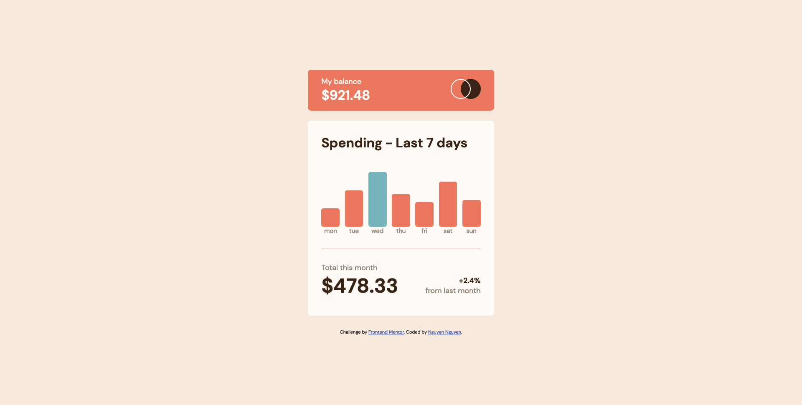

# Frontend Mentor - Insure landing page solution

This is a solution to the [Expenses chart component main challenge on Frontend Mentor](https://www.frontendmentor.io/challenges/expenses-chart-component-e7yJBUdjwt/hub/expenses-chart-component-wppxDt29BO). Frontend Mentor challenges help you improve your coding skills by building realistic projects.

## Table of contents

- [Overview](#overview)
  - [The challenge](#the-challenge)
  - [Screenshot](#screenshot)
  - [Links](#links)
- [My process](#my-process)
  - [Built with](#built-with)
  - [What I learned](#what-i-learned)
  - [Continued development](#continued-development)
  - [Useful resources](#useful-resources)
- [Author](#author)
- [Acknowledgments](#acknowledgments)

## Overview

### The challenge

Users should be able to:

- View the optimal layout for the site depending on their device's screen size
- See hover states for all interactive elements on the page

### Screenshot



### Links

- Solution URL: [View codes](https://github.com/jesuisbienbien/expenses-chart-component-main)
- Live Site URL: [View Live Site](https://jesuisbienbien.github.io/expenses-chart-component-main/)

## My process

## Project completion time

- Expectation: 1 month
- Reality: 6 days
  - Start date: 7/18/2022
  - Complete date:7/23/2022

### Built with

- Semantic HTML5 markup
- Flexbox
- Mobile-first workflow
- Vanilla Javascript

### What I learned

**_find the index of a node in nodelist using spread operator_**

```javascript
const index = [...chartBars].indexOf(bar);
```

**_change the height of bar chart using js and css variable_**

```javascript
chartBars[i].style.height = `calc(${data[i].amount}px * var(--scale))`;
```

### Continued development

### Useful resources

- mouseover event - [mdn](https://developer.mozilla.org/en-US/docs/Web/API/Element/mouseover_event)

## Author

- Github - [Nguyen Nguyen](https://github.com/jesuisbienbien)
- Frontend Mentor - [@jesuisbienbien](https://www.frontendmentor.io/profile/jesuisbienbien)

## Acknowledgments
